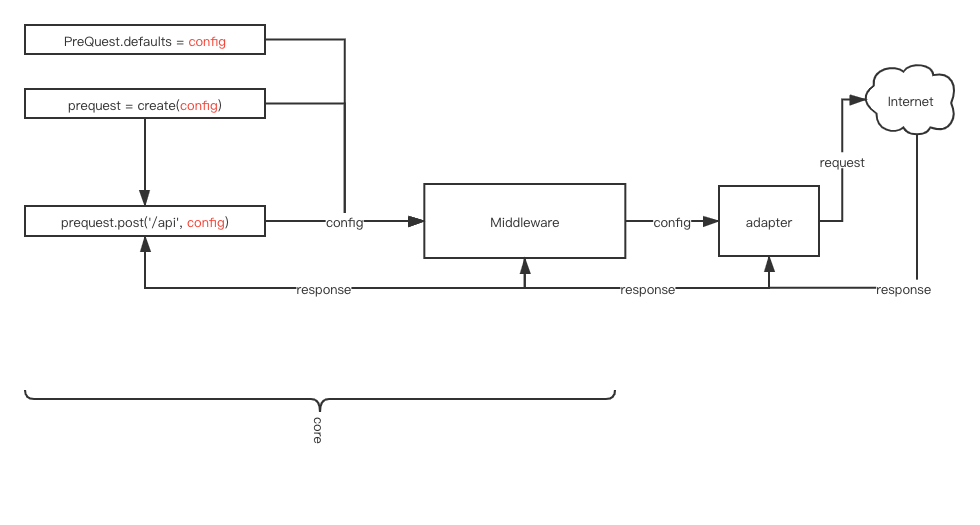

# PreQuest

一套模块化，可插拔的 JS 运行时 HTTP 请求解决方案。

## 概述

PreQuest 是一套 JS 运行时的 HTTP 解决方案。

它包含了一些针对不同 JS 运行平台的封装的请求库，并为这些请求库提供了一致的中间件、拦截器、全局配置等功能的体验

还针对诸如 Token 的添加，失效处理，无感知更新、接口缓存、错误重试等常见业务场景，提供了解决方案。

此外也针对 React 端提供了复用 PreQuest 实例的 request hook 来使用。

当这些功能不满足你的需求、或者你想定制化时，也可以基于 [@prequest/core](/core) 快速封装一个实现你需求的请求库。

## 异同

PreQuest 与 axios、umi-request 的区别在于，PreQuest 并不是一个请求库，而是一套解决方案。

### 对于库的开发者来说

你可以很容易的基于 [@prequest/core](/core)，快速封装一个类似 axios 的请求库。

### 对于业务开发者来说

如果你新建了一个项目，你可以集成 [@prequest/xhr](https://github.com/xdoer/PreQuest/tree/main/packages/xhr) 等几个直接封装好的请求库。

如果你使用的是 axios、umi-request 这类请求库，那么你可以很容易的在项目中[集成 PreQuest](/work-with-axios)；

如果你的项目使用的是自己封装的原始 Http 请求，那么你可以通过 [@prequest/wrapper](https://github.com/xdoer/PreQuest/tree/main/packages/wrapper) 很容易的迁移到 PreQuest 中；

## 原理

用过 axios 的都知道，axios 中有 adapter 的概念，它是一个包含请求内核的适配器函数，且 axios 内置了两个 adapter: 一个是基于 XMLHttpRequest、一个基于 Node Http 模块。

PreQuest 中也有 adapter 的概念，功能与 axios 的一样，但不同的是，PreQuest 核心（@prequest/core）没有内置 adapter。adapter 由基于 PreQuest 核心封装的请求库来实现。PreQuest 核心并不参与对参数的处理，所有请求参数在经过中间件后会直接传到 adapter 中。

## 灵感

在写小程序的时候，发现并没有一个好用的类似 axios 的请求库，想基于 axios 封装一个小程序端用的请求库。在阅读 axios 和 umi-request 源码后发现，请求内核和上层架构其实完全可以分离开，axios 与 umi-request 等库可能基于品牌推广等缘由，将 web 端和 node 端的请求库杂糅到了一份代码里，导致请求参数冗余，且不好扩展，因而自己封装了 PreQuest，它采用 TypeScript 语法，用户可以针对不同的平台，基于自己的业务，快速封装一套高定制的请求库。

## 文章

[由封装一个请求库所想到的](https://aiyou.life/post/M4RcI3wfU/)

## 交流

